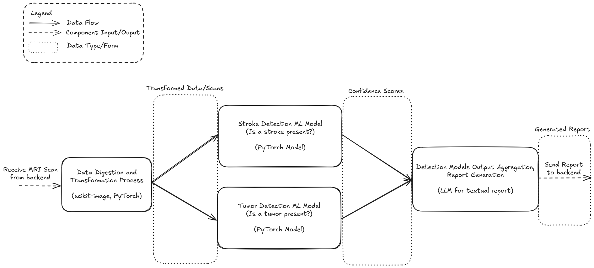

# Machine-Learning project

## ml-backend server
### To develop:
- Create a python3 venv
`python3 -m venv ml`
- Activate venv
`. .venv/bin/activate`
- Install requirements
`pip install -r requirements.txt`
- Run flask server
`flask run`
